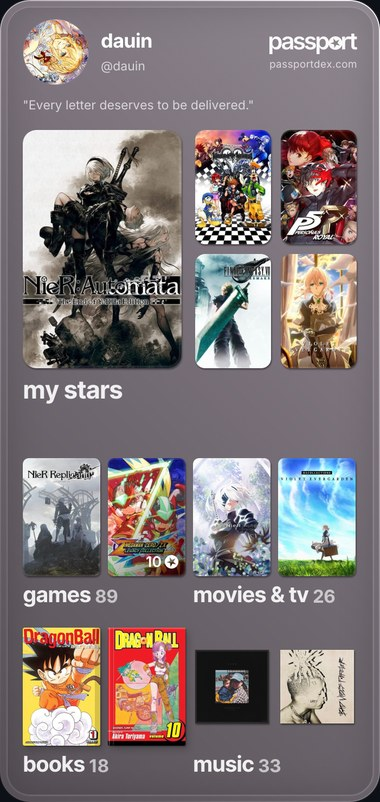

<p align="center">

```
                     
,--. ,---..   .|,   .
|   ||---||   |||\  |
|   ||   ||   ||| \ |
`--' `   '`---'``  `'
                     
```


</p>

<h2 align="center">𝗜𝗡𝗧𝗥𝗢</h2>

<table align="center"><tr><td>

</td></tr></table>

```
┌─ whoami.txt ────────────────────────────────────────────────────────────┐
│ ▸ Computer Engineer                                                    │
│ → Into agentic programming — building with AI, not just using it       │
│ ▪ Full-stack + IT support + networking, all in one                     │
│ ▴ Eternal student — always hungry for more to learn                    │
│ ≡ Hardware enthusiast at heart                                         │
│ ► Available for freelance & remote work                                │
│ ○ I live in the terminal — and in the windows too (CachyOS main, though)│
│ » Clauding my way forward, step by step.                               │
│ ● "Everything that lives is designed to end"... meanwhile, I leave proof│
│    of my existence on my passport ↓                                    │
└────────────────────────────────────────────────────────────────────────┘
```

<!-- live OG image is blocked by Cloudflare for server-side fetches (GitHub camo can't reach it).
     Darwin downloaded his own share card manually (works fine from his own logged-in browser) --
     using that as a static asset instead. Won't auto-update; regenerate manually when it's stale. -->
<p align="center">
<a href="https://passportdex.com/dauin"></a>
</p>

<h2 align="center">𝗣𝗥𝗢𝗝𝗘𝗖𝗧𝗦</h2>

```
┌─ projects.log ────────────────────────────────────────────────────────┐
│ channel-3/   NES emulator, browser-based — WebGL CRT, netplay.  [soon]│
│ kintsugi/    Go TUI, Windows LTS ISOs — DISM internals.         [wip]│
└──────────────────────────────────────────────────────────────────────┘
```

<!-- TODO: swap in real repo link + final name once Channel 3 is published -->
<!-- TODO: add real repo link once Kintsugi has a demoable run -->

<h2 align="center">𝗖𝗢𝗡𝗧𝗔𝗖𝗧</h2>

<table align="center"><tr><td>

</td></tr></table>

```
┌─ contact.txt ─────────┐
│ Best way to reach me →│
└──────────────────────┘
```

<table align="center"><tr><td align="center">
<a href="https://github.com/dau-in"><b>→ github.com/dau-in</b></a>
</td></tr></table>

<p align="center">
<a href="https://discord.com/users/780932598922084384"></a>
<a href="https://open.spotify.com/user/31aluwrafhtrzpee4pqzyodbvusm"></a>
<a href="https://steamcommunity.com/id/dauin"></a>
</p>

<p align="center"><sub></sub></p>

<!-- TODO: replace Discord badge with lanyard-profile-readme widget once account is monitored -->
<!-- TODO: Spotify/Steam -> real stats + last played/listened, once decided -->
<!-- TODO: stats section (WakaTime / github-readme-stats), once decided -->
