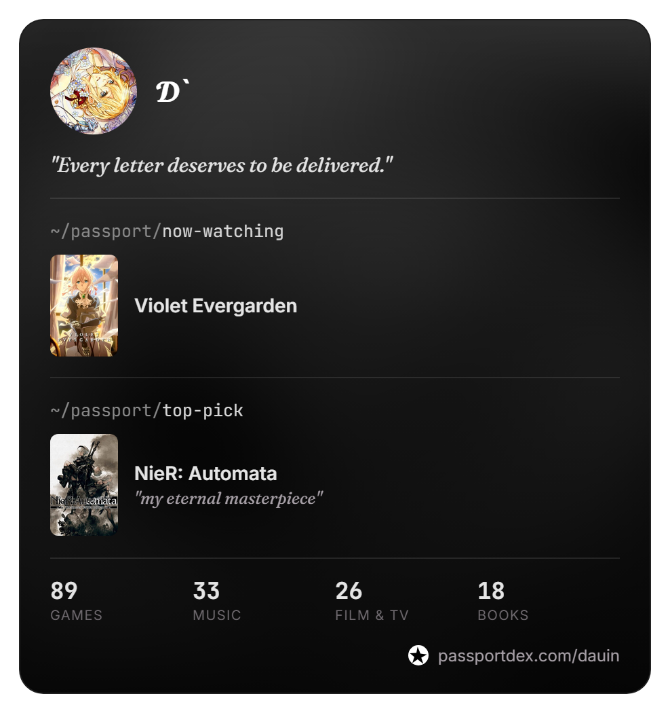

<p align="center"></p>

<table align="center"><tr>
<td></td>
<td align="center" valign="middle">

```

,--. ,---..   .|,   .
|   ||---||   |||\  |
|   ||   ||   ||| \ |
`--' `   '`---'``  `'

```

</td>
</tr></table>

<div align="center">

```
┌─ whoami.txt ────────────────────────────────────────────────────────────────┐
│ *  Computer Engineer                                                        │
│ >  Into agentic programming — building with AI, not just using it           │
│ -  Full-stack + IT support + networking, all in one                         │
│ ^  Eternal student — always hungry for more to learn                        │
│ =  Hardware enthusiast at heart                                             │
│ +  Available for freelance & remote work                                    │
├─────────────────────────────────────────────────────────────────────────────┤
│ ~  I live in the terminal — and in the windows too (CachyOS main, though)   │
│ <  Clauding my way forward, step by step.                                   │
│ #  "Everything that lives is designed to end"... meanwhile, I leave proof   │
│    of my existence on my passport ↓                                         │
└─────────────────────────────────────────────────────────────────────────────┘
```

</div>

<hr>

<p align="center"></p>

| project | description | status |
|---|---|---|
| **channel-3** | NES emulator, browser-based — WebGL CRT, netplay | soon |
| **kintsugi** | Go TUI — Windows LTSB/LTSC/Legacy ISOs, DISM internals | wip |

<!-- TODO: swap in real repo link + final name once Channel 3 is published -->
<!-- TODO: add real repo link once Kintsugi has a demoable run -->

<hr>

<p align="center">∴ off the clock: games, music, and a terminal that never quite closes — full taste below ↓</p>

<p align="center">
<a href="https://passportdex.com/dauin"></a>
</p>

<hr>

<p align="center"><sub>◇ art by <a href="https://x.com/inoitoh">@inoitoh</a> on twt</sub></p>

<!-- TODO: replace static passport card with a live embed once passportdex offers one -->
<!-- TODO: Discord/Spotify/Steam widgets, once decided how -->
<!-- TODO: stats section (WakaTime / github-readme-stats), once decided -->
